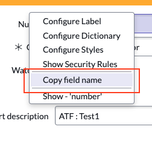

# 📌 ServiceNow UI Macro: Context Menu Customization

[![Contributors][contributors-shield]][contributors-url]
[![Forks][forks-shield]][forks-url]
[![Stargazers][stars-shield]][stars-url]
[![Issues][issues-shield]][issues-url]
[![license-shield]][license-url]

## 📝 Description
This project extends the **ServiceNow** form label context menu by adding an option to **copy the field name**.



### ✨ Features
- Adds a new "Copy Field Name" option to the context menu.
- Allows users to copy the field name to the clipboard with one click.
- Accessible only to administrators (`admin`).

---

## 📂 Installation

1. **Open ServiceNow** and navigate to **System UI > UI Macros**.
2. Create a new UI Macro named **context_personalize_menu**.
3. Copy and paste the code from [`context_personalize_menu.xml`](context_personalize_menu.xml).
4. Save the changes and test it in a form.

---

## 🚀 Usage

1. **Open a form in ServiceNow**.
2. **Right-click on a field label**.
3. **Select "Copy Field Name"**.
4. The field name will be copied automatically to the clipboard.

---

## 🛠 Customization
If you want to modify the functionality, you can edit the `copyFieldName()` function in the UI Macro:
```javascript
function copyFieldName(fieldName) {
    var tempInput = document.createElement("input");
    tempInput.value = fieldName;
    document.body.appendChild(tempInput);
    tempInput.select();
    document.execCommand("copy");
    document.body.removeChild(tempInput);
    alert("Field name copied: " + fieldName);
}
```

---

## 📢 Contributions
Contributions are welcome! To contribute:
1. **Fork** the repository.
2. Create a new branch (`feature/new-feature`).
3. Make changes and submit a **Pull Request**.

---

## 📜 License
This project is distributed under the **MIT License**. Feel free to use it! 🎉


[contributors-shield]: https://img.shields.io/github/contributors/AlexAlvarez092/SN-CopyFieldName.svg?style=for-the-badge
[contributors-url]: https://github.com/AlexAlvarez092/SN-CopyFieldName/graphs/contributors

[forks-shield]: https://img.shields.io/github/forks/AlexAlvarez092/SN-CopyFieldName.svg?style=for-the-badge
[forks-url]: https://github.com/AlexAlvarez092/SN-CopyFieldName/network/members

[stars-shield]: https://img.shields.io/github/stars/AlexAlvarez092/SN-CopyFieldName.svg?style=for-the-badge
[stars-url]: https://github.com/gAlexAlvarez092/SN-CopyFieldName/stargazers

[issues-shield]: https://img.shields.io/github/issues/AlexAlvarez092/SN-CopyFieldName.svg?style=for-the-badge
[issues-url]: https://github.com/AlexAlvarez092/SN-CopyFieldName/issues

[license-shield]: https://img.shields.io/github/license/AlexAlvarez092/SN-CopyFieldName.svg?style=for-the-badge
[license-url]: https://github.com/AlexAlvarez092/SN-CopyFieldName/blob/master/LICENSE.txt